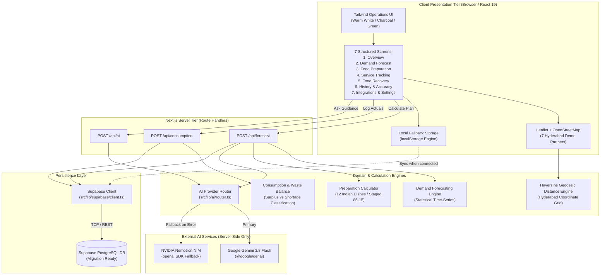

# FOODFLOW — Complete System Architecture
*VISTERA 2026 Hackathon • Problem Statement PS-44: Cutting Food Waste*  
*Audit Timestamp: October 9, 2026*

---

## 1. System Architecture Diagram

---

## 2. Component Descriptions

### 2.1 Presentation Tier
- **Framework**: Next.js 16.4.0 (Turbopack) and React 19.
- **Design Tokens**: Warm white (`#FAFAF9`), dark charcoal (`stone-900`), restrained emerald (`emerald-700`).
- **GIS Component**: Leaflet + OpenStreetMap running purely client-side via dynamic import (`next/dynamic` with `ssr: false`).

### 2.2 Server Tier
- **Isolates Secrets**: Credentials (`GEMINI_API_KEY`, `NVIDIA_API_KEY`) remain strictly on the server.
- **Deterministic Math First**: Numerical forecasting and culinary batch calculations run directly on server CPUs using pure TypeScript arithmetic before requesting qualitative AI summaries.

### 2.3 Persistence Tier
- **Dual-Storage Strategy**: Reads and writes through `src/lib/supabase/service.ts`, falling back gracefully to `localStorage` if remote database tables have not been created.
