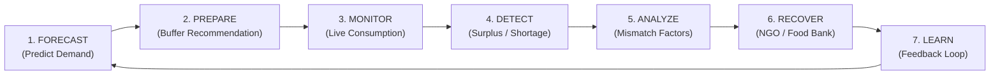
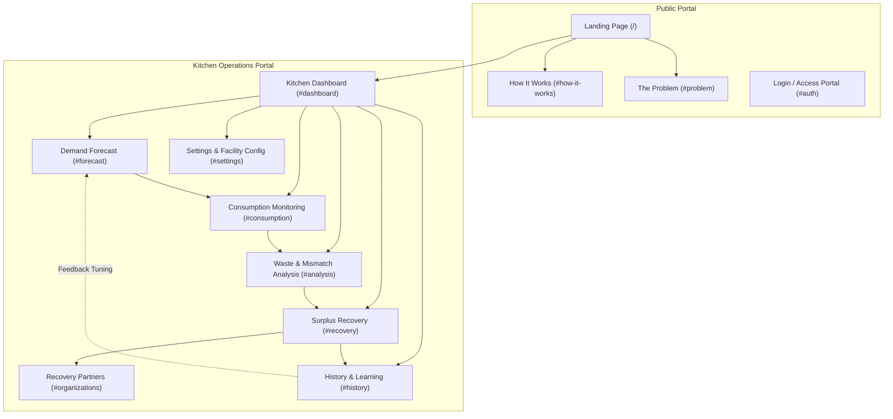
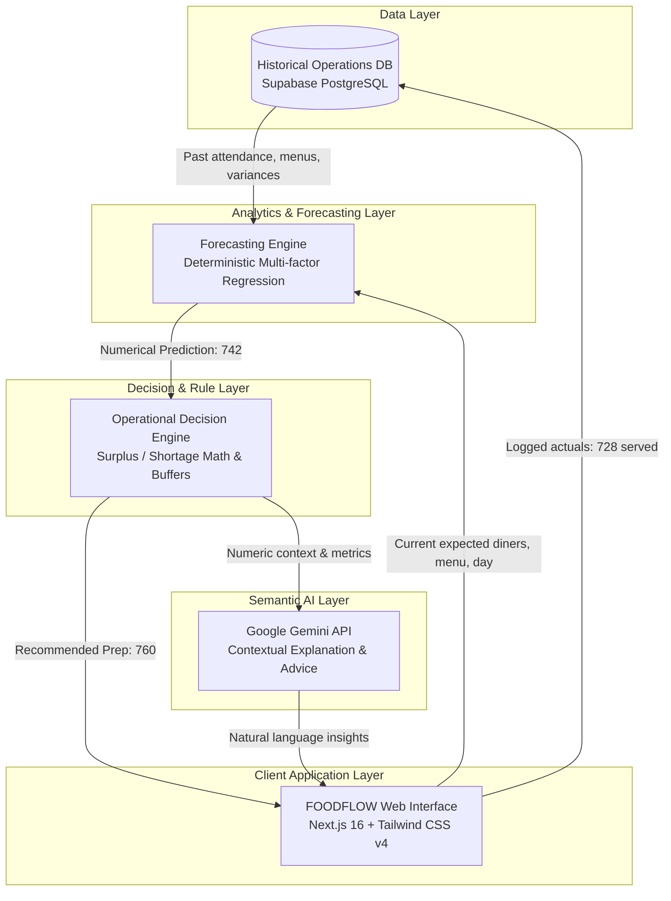
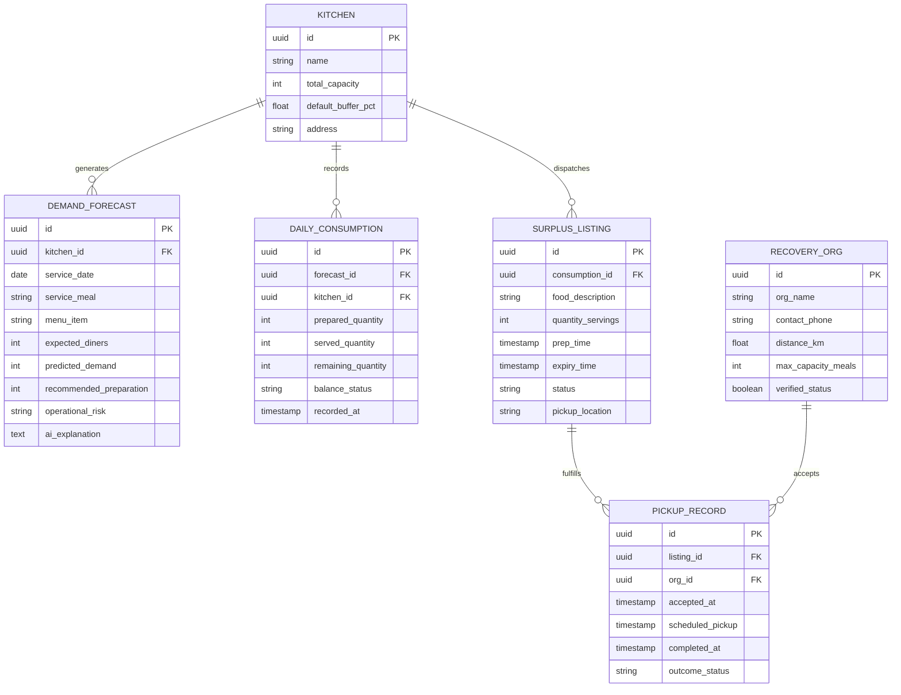
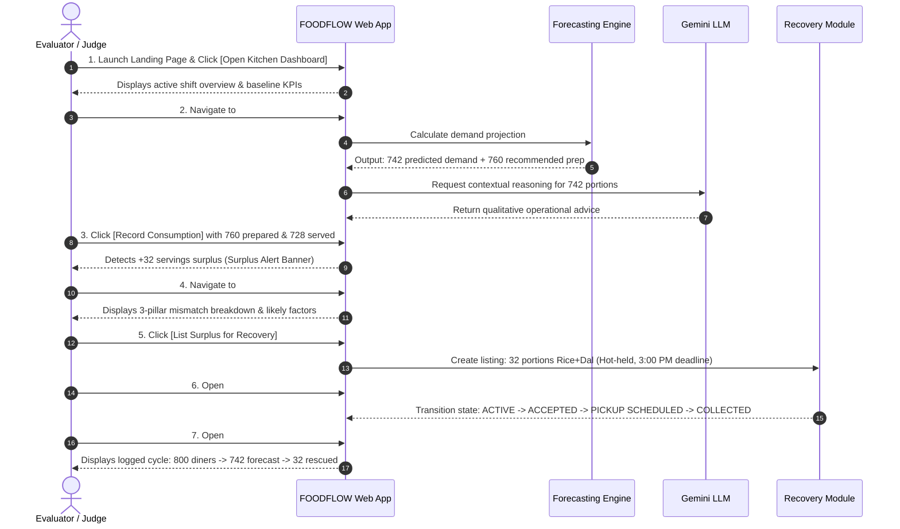

# FOODFLOW — Comprehensive Product Blueprint & System Specification
**AI-Powered Food Waste Prevention & Surplus Recovery Platform**  
*Hackathon: VISTERA 2026 | Problem Statement: PS-44 — Cutting Food Waste*  
*Tagline: Predict. Prevent. Recover.*

---

> [!IMPORTANT]
> **Blueprint Scope & Status Notice**  
> This document is the authoritative **System & Product Blueprint** for FOODFLOW. It defines all user interfaces, operational workflows, data contracts, and architectural boundaries before further production code or backend integrations are executed. All numerical quantities, organizational listings, and telemetry records displayed in this blueprint represent **Illustrative Demo Data** for hackathon prototyping and evaluation purposes.

---

## 1. Product Overview & Core Objective

### 1.1 Executive Summary
FOODFLOW is a closed-loop institutional food management platform engineered to resolve the twin failure modes of institutional dining: **avoidable overproduction waste** and **unexpected food shortages**. 

Rather than relying on rough headcount guesswork or treating food waste as an inevitable downstream disposal problem, FOODFLOW couples **predictive demand forecasting** with **real-time consumption monitoring** and a **verified surplus recovery network**.

### 1.2 Target Facilities
- **Higher Education Dining Halls & Hostels** (e.g., college canteens with fluctuating student attendance)
- **Corporate Cafeterias** (hybrid work schedule variances)
- **Healthcare & Hospital Food Services** (patient and staff shift catering)
- **Large-Scale Institutional Catering Operations** (events, conferences, training centres)

### 1.3 The 7-Stage Closed-Loop Operational Lifecycle

| Stage | Operational Action | Core Actor / Engine | Key Metric / Output |
| :--- | :--- | :--- | :--- |
| **1. FORECAST** | Synthesize calendar, historical demand, and diner reservations | Time-Series Forecasting Engine | Numerical demand prediction (~742 servings) |
| **2. PREPARE** | Determine safe production batches with calibrated buffers | Kitchen Manager + Rule Layer | Recommended preparation target (~760 servings) |
| **3. MONITOR** | Record actual portions served during live service windows | Counter Staff / POS Telemetry | Real-time served count (e.g., 728 served) |
| **4. DETECT** | Continuously calculate variance between prepared and served | Business Logic Layer | Surplus detection (+32) or Shortage risk alert |
| **5. ANALYZE** | Evaluate root causes (attendance drop, menu preference) | Gemini LLM + Analytics | Likely mismatch factors & actionable takeaways |
| **6. RECOVER** | Route verified eligible surplus to local certified NGOs | Recovery Network Module | Digital listing, claim, and pickup chain |
| **7. LEARN** | Log variances and operational factors to history store | Database Feedback Loop | Calibrates next cycle's safety buffer |

---

## 2. Page & System Sitemap

### Navigation Matrix
- **Global Top Navigation (Sticky Header):** Quick-switch tabs between all primary operational screens: `Overview`, `Forecast`, `Consumption`, `Analysis`, `Recovery`, `Organizations`, `History`, `Settings`.
- **Contextual Workflows:** Contextual CTAs link screens sequentially (e.g., clicking *"Record Consumption"* from the Forecast output opens the Consumption screen pre-populated with recommended preparation).
- **Responsive Navigation Drawer:** On mobile (<768px) and tablet (<1280px), collapsible sliding drawer prevents horizontal overflow.

---

## 3. Screen-by-Screen Specifications

### 3.1 Public Landing Page (`/`)
- **Hero Banner:**
  - Brand: `FOODFLOW`
  - Headline: *"Cook for the demand. Not for the guess."*
  - Subtitle: *"FOODFLOW helps institutional kitchens forecast demand, reduce avoidable overproduction, and responsibly recover eligible surplus."*
  - Dual CTAs: `[ Open Kitchen Dashboard ]` (Primary Green) and `[ See How It Works ]` (Secondary Ghost).
  - Visual Banner: Interactive 7-stage closed-loop stepper (`FORECAST → PREPARE → MONITOR → DETECT → ANALYZE → RECOVER → LEARN`).
- **Problem Statement (PS-44 Focus):**
  - Card 1: *Overproduction & Cost Drain* — Commercial kitchens routinely overprepare by 15–25% to avoid running out, generating massive avoidable food waste.
  - Card 2: *Underproduction & Shortage Panic* — Abrupt attendance spikes leave diners without meals, damaging kitchen reputation.
  - Card 3: *Uncertain Demand Variables* — Weather, exams, day of week, and menu combinations make manual estimation notoriously unreliable.
- **Solution Overview:** Explain FOODFLOW as a dual-engine decision-support system: deterministic numerical forecasting coupled with natural-language operational reasoning.
- **Target Sectors:** Visual badges highlighting University Canteens, Corporate Dining, Hospital Dietary Facilities, and Institutional Hostels.

---

### 3.2 Kitchen Dashboard (`#dashboard`)
- **Context Header:**
  - Greeting: *"Good morning, Kitchen Manager"*
  - Timestamp & Active Shift: *"Wednesday Lunch Service | Campus Central Dining Hall"*
- **KPI Summary Cards (Illustrative Demo Data):**
  1. **Expected Diners:** `800` (Based on badge scans / hostel roster)
  2. **Predicted Demand:** `742` servings (Confidence interval: 730–755)
  3. **Recommended Preparation:** `760` servings (+2.4% safety buffer)
  4. **Current Surplus:** `32` servings (Recorded post-service)
- **Active Visualizations:**
  - **Demand vs. Actual Trend Chart:** Multi-line timeline charting projected hourly demand vs. logged meal servings.
  - **Live Service Status Indicator:** Visual gauge showing consumption pacing (e.g., `95.8% Service Completed`).
  - **Recent Activity Feed:** Real-time log of forecast creations, counter updates, and NGO pickup verifications.
- **Quick Action Dock:**
  - `[ Generate New Forecast ]` → Direct jump to `#forecast`
  - `[ Update Meal Consumption ]` → Direct jump to `#consumption`
  - `[ Review Waste Analysis ]` → Direct jump to `#analysis`
  - `[ List Eligible Surplus ]` → Direct jump to `#recovery`

---

### 3.3 AI Demand Forecast Screen (`#forecast`)
- **Operational Inputs Form:**
  - **Expected Registered Diners:** Numeric input + precision slider (Range: 50 – 5,000).
  - **Day of Week:** Selector (`Monday` through `Sunday`).
  - **Meal Service Category:** Radio pill selection (`Breakfast`, `Lunch`, `Dinner`).
  - **Menu Type:** Pre-calibrated institutional recipes (e.g., `Rice + Dal + Chicken Curry`, `Paneer Butter Masala + Roti`, `Continental Buffet`).
  - **Special Context / Event Factor:** Dropdown (`None`, `Campus Sports Meet`, `Rainstorm / Heavy Weather`, `Exam Week`, `Holiday Eve`).
- **Forecasting Engine Output Panel:**
  - **Predicted Demand:** `742` servings
  - **Recommended Preparation:** `760` servings (Includes calculated +18 serving safety buffer)
  - **Calculated Operational Risk:** `MEDIUM` (Driven by weekday historical variance)
  - **Baseline Comparison:** `-4.8% vs Standard 800-portion batch` (Prevents 40 redundant meals from being cooked).
- **AI Operational Insight Panel (Powered by Gemini):**
  - Distinct badge: `AI EXPLANATION & CONTEXTUAL REASONING`
  - Text summary: *"Demand is projected at 742 servings (~7.2% below maximum roster). Historical Wednesday trends indicate chicken curry retains strong core turnout, but mid-week lab schedules reduce sit-down dining. A preparation target of 760 provides a sufficient safety cushion without triggering severe surplus."*
  - Badge notice: `DEMO AI INSIGHT — DECISION SUPPORT ONLY`

---

### 3.4 Preparation Recommendation Engine
- **Decision Logic:** Translates predicted demand into physical kitchen batch commands.
- **Safety Margin Algorithm:**
  $$\text{Recommended Prep} = \text{Predicted Demand} \times (1 + \text{Buffer Factor})$$
  *(Default buffer: +2.0% to +3.5% based on facility volatility rating).*
- **Batching Advice:** Recommends split-batch cooking (e.g., *Batch 1: 550 servings ready at 12:00 PM; Batch 2: 210 servings on stand-by at 1:15 PM if counter pace exceeds 65%*).
- **Staff Responsibility Notice:** Clear UI disclaimer stating that final cooking quantities must be reviewed and authorized by the Head Chef or Kitchen Supervisor.

---

### 3.5 Live Consumption Monitoring Screen (`#consumption`)
- **Counter Input Fields:**
  - **Total Prepared Meals:** `760` (Inherited from preparation recommendation, editable).
  - **Total Meals Served:** `728` (Logged at the end of service window or entered in real-time).
  - **Remaining Balance:** Auto-calculated: $\text{Prepared} - \text{Served} = 32$.
- **Real-Time Status Indicator (Three Operational States):**
  1. **Surplus State ($\text{Prepared} > \text{Served}$):**
     - Banner: `POTENTIAL SURPLUS DETECTED`
     - Metric: `+32 Servings remaining in kitchen warmers`
     - CTA: `[ Route to Surplus Recovery ]`
  2. **Shortage Warning State ($\text{Served} \ge \text{Prepared}$ or pacing indicates imminent depletion):**
     - Banner: `SHORTAGE RISK DETECTED`
     - Metric: `-35 Servings deficit / Diners turned away`
     - Advisory: Immediate alert to deploy emergency auxiliary items (e.g., quick-cook eggs or bread).
  3. **Balanced State ($|\text{Prepared} - \text{Served}| \le 10$):**
     - Banner: `BALANCED SERVICE ACHIEVED`
     - Metric: Optimal efficiency (>98.5% food utilization).
- **Pacing Progress Bar:** Visual bar illustrating portions served vs. remaining warm holding capacity.

---

### 3.6 Waste & Mismatch Analysis Screen (`#analysis`)
- **Three-Pillar Variance Breakdown:**
  - Metric 1: **Predicted Demand** = `742 servings`
  - Metric 2: **Actual Meals Served** = `728 meals` (Forecast Delta: $-14$ meals / $1.9\%$ error)
  - Metric 3: **Total Prepared** = `760 portions` (Final Overproduction: $+32$ portions / $4.2\%$)
- **Root-Cause Attribution Matrix (Qualitative Likely Factors):**
  - *Factor 1 (Attendance Variance):* Unscheduled afternoon sports practice reduced residential hostel turnout by ~15 diners.
  - *Factor 2 (Preparation Over-buffer):* Flat safety buffer (+18) was slightly wider than necessary for high-confidence menu items.
  - *Factor 3 (Menu Pacing):* Chicken curry side items exhausted 10 minutes prior to steamed rice, leaving residual staple grains.
- **Actionable Takeaways Panel:**
  - *"For future Wednesday lunch cycles with similar expected attendance, kitchen can safely calibrate buffer to +10 servings rather than +18, saving an estimated 12–15kg of raw provisions."*

---

### 3.7 Continuous Learning & History Screen (`#history`)
- **Feedback Loop Record:**
  - Displays persistent historical records linking past predictions, weather events, actual turnouts, and recovery outcomes.
- **Historical Data Table:**
  | Date | Menu | Expected Diners | Forecast Demand | Prepared | Served | Surplus / Deficit | Recovery Status |
  | :--- | :--- | :---: | :---: | :---: | :---: | :---: | :--- |
  | **Oct 08 (Wed)** | Rice + Dal + Chicken | 800 | 742 | 760 | 728 | **+32 Surplus** | Collected (Hope Care) |
  | **Oct 07 (Tue)** | Rajma Chawal + Salad | 750 | 710 | 725 | 718 | **+7 Balanced** | Kitchen Repurposed |
  | **Oct 06 (Mon)** | Veg Pulao + Raita | 820 | 790 | 790 | 815 | **-25 Shortage** | Auxiliary Batch |
  | **Oct 03 (Fri)** | South Indian Thali | 850 | 765 | 780 | 740 | **+40 Surplus** | Collected (Annakshetra) |
- **Filter Bar:** Filter historical runs by Date Range, Day of Week, Menu Category, and Variance State (Surplus / Balanced / Shortage).
- **Visual Analytics:** Multi-week rolling chart comparing Forecast Accuracy vs. Cumulative Surplus Diverted.

---

### 3.8 Surplus Recovery & Listing Management (`#recovery`)
- **Surplus Declaration Workflow:**
  - Initiated when $\text{Remaining} > 15$ servings and staff marks food as hygienically handled and eligible for donation.
- **Listing Data Fields:**
  - **Food Item Description:** e.g., *"Steamed Basmati Rice & Tadka Dal (Hot-held in insulated containers)"*
  - **Available Quantity:** `32 Servings (~16 kg)`
  - **Preparation Timestamp:** `12:30 PM`
  - **Safe Pickup Deadline:** `3:00 PM` *(Strict 2.5-hour safe temperature limit)*
  - **Storage / Temperature State:** `Hot-Held (>65°C)`
  - **Kitchen Dispatch Location:** `Campus North Dining Hall, Bay 2 Loading Dock`
  - **Special Handling Notes:** *"Requires clean food-grade transport canisters."*
- **Listing Lifecycle State Machine:**
  $$\text{ACTIVE} \longrightarrow \text{VIEWED} \longrightarrow \text{ACCEPTED} \longrightarrow \text{PICKUP SCHEDULED} \longrightarrow \text{COLLECTED}$$
- **Food Safety Responsibility Standard:**
  > [!WARNING]
  > FOODFLOW operates as an informational dispatch bridge. All food items must comply with local institutional safety regulations. Kitchen supervisors must verify safe holding temperature prior to handover.

---

### 3.9 Recovery Partners & Organizations Screen (`#organizations`)
- **Partner Registry Cards (Illustrative Demo Data):**
  1. **City Food Relief Foundation:** Verified Demo Partner | 2.4 km away | Capacity: 100+ meals | Hot meals accepted | Availability: Immediate.
  2. **Hope Care Shelter:** Verified Demo Partner | 3.8 km away | Capacity: 50 meals | Cooked food & baked goods | Availability: 30-minute notice.
  3. **Youth Hunger Project:** Verified Demo Partner | 5.1 km away | Capacity: 80 meals | Dry rations & prepared staples | Availability: Evening dispatch.
- **Interactive Map / Spatial Panel:**
  - Shows kitchen hub location pin alongside radial markers for surrounding partner facilities.
  - Includes graceful fallback if third-party map tiles are unauthenticated: renders internal stylized spatial grid without crashing.
- **Direct Dispatch Action:** One-click `[ Dispatch Surplus to Partner ]` transitions the active listing directly to `ACCEPTED` and populates ETA metrics.

---

### 3.10 Settings & Operational Parameters (`#settings`)
- **Facility Profile:** Institution Name, License ID, Default Dining Hall Capacity (e.g., 1,200 seats).
- **Buffer Thresholds:** Adjustable baseline safety margin slider (1.0% to 5.0%, default 2.4%).
- **AI Engine Preferences:** Primary LLM Provider toggle (`Google Gemini 2.5/Flash` vs. `NVIDIA Nemotron` fallback).
- **Security & Privacy:** Environmental variable status audit confirming zero API keys exposed in browser bundle.

---

## 4. AI & Systems Architecture

### 4.1 Explicit Separation of Concerns

### 4.2 Architecture Rule: What Each Component Does

| Component | Technology | Responsibility | What It Must NEVER Do |
| :--- | :--- | :--- | :--- |
| **Forecasting Engine** | Time-Series Analytics & Regressive Formulas | Generates numerical prediction (e.g., `742 servings`) | Never writes free-form conversational text |
| **Decision / Rule Layer** | Deterministic TypeScript Logic | Calculates buffer margins, surpluses, and shortage states | Never produces arbitrary hallucinations |
| **LLM Reasoning Layer** | Google Gemini API (via server route) | Generates plain-English explanations and contextual suggestions | **NEVER generates raw numerical predictions** |
| **Data Storage Layer** | Supabase / PostgreSQL | Stores menus, historical meals, listings, and telemetry | Never executes business logic directly |
| **Map Service** | Vector / Spatial Dispatch Fallback | Displays facility locations and pickup routing | Never stores sensitive credentials on client |

---

## 5. Database Schema Blueprint

---

## 6. End-to-End Benchmark Demonstration Scenario

The application is structured to reliably demonstrate the complete **7-Stage Closed Loop** in under **2.5 minutes** during a hackathon evaluation:

---

## 7. MVP vs. Optional Feature Matrix

| Feature Module | In Hackathon MVP | Post-Hackathon / Optional | Technical Rationale |
| :--- | :---: | :---: | :--- |
| **Interactive Landing Page** | **YES** | — | Essential for establishing problem context and visual workflow. |
| **Kitchen KPI Dashboard** | **YES** | — | Core landing view for the kitchen manager persona. |
| **Forecasting Input Form** | **YES** | — | Demonstrates operational variable capture (diners, menu, date). |
| **Numerical Forecast Engine** | **YES** | — | Deterministic prediction logic cleanly separated from the LLM. |
| **Gemini AI Insight Panel** | **YES** | — | Demonstrates qualitative operational decision support. |
| **Real-time Consumption Logger** | **YES** | — | Calculates surplus (+32) and shortage (-35) states dynamically. |
| **Mismatch & Waste Analysis** | **YES** | — | Breaks down variance factors without false causality claims. |
| **Surplus Recovery Workflow** | **YES** | — | Demonstrates full digital dispatch chain from listing to collection. |
| **Demo Partner Registry** | **YES** | — | Realistic partner cards with clear "Demo Data" labeling. |
| **Closed-Loop History Log** | **YES** | — | Demonstrates how past outcomes feedback into future planning. |
| *Turnstile RFID Hardware Sync* | NO | **YES** | Simulated via counter inputs during live presentation. |
| *Automated SMS/WhatsApp Dispatch*| NO | **YES** | Mocked in-app to avoid carrier latency and API costs. |
| *Satellite Weather Micro-forecast*| NO | **YES** | Replaced with weather dropdown selector. |
| *Multi-tenant Enterprise RBAC* | NO | **YES** | Simplified to single-kitchen manager role for demo. |

---

## 8. Responsible AI & Security Standards

### 8.1 Zero-Hallucination & Honest AI Principles
- **No Fabricated Numerical Models:** The interface explicitly labels numerical demand numbers as originating from the `FORECASTING ENGINE`, not generated spontaneously by Gemini.
- **Causality Integrity:** Waste explanations use calibrated terminology (*"Likely contributing factors based on historical correlations"*) rather than asserting absolute knowledge of diner behavior.
- **No Unsupported Marketing Metrics:** The UI strictly avoids unsubstantiated marketing exaggerations (e.g., claiming *"99.9% waste elimination"* or *"100% certified food safety"*). All benchmark metrics are stamped as `Illustrative Demo Data`.

### 8.2 Security & Credential Hygiene
- **Strict Server-Side AI Execution:** All calls to Google Gemini or secondary LLM endpoints execute strictly inside server-side Next.js route handlers (`/api/ai/route.ts`).
- **Zero Frontend Secrets:** No API keys (`GEMINI_API_KEY`, `SUPABASE_SERVICE_ROLE_KEY`) are ever imported or referenced within client-side React components.
- **Defensive Fallback Protocol:** If upstream AI or map APIs experience network outages, the UI gracefully renders deterministic fallback cards (*"AI explanation temporarily unavailable; numerical forecast remains intact"*).

---

## 9. Design System & Visual Direction

### 9.1 Aesthetic Philosophy: "Cinematic Sustainability Operations"
FOODFLOW rejects both sterile enterprise utility and glowing "cyberpunk AI" tropes. It utilizes an organic, purposeful palette inspired by high-end agricultural and culinary technology:
- **Base Surfaces:** Warm Ivory (`#FBFBF9`), Soft Alabaster (`#F4F4EE`), Crisp White (`#FFFFFF`).
- **Primary Accent:** Deep Forest Emerald (`#0E382B` / `#164E3D`) signifying sustainability, reliability, and growth.
- **Secondary Accent:** Muted Golden Harvest Amber (`#D97706` / `#F59E0B`) signifying kitchen warmth and caution states.
- **Alert Tones:** Terracotta Red (`#DC2626`) for shortage warnings; Soft Sage (`#10B981`) for surplus recovery.
- **Typography:** Modern clean sans-serif typography (`Inter` / `system-ui`) with clear numerical hierarchy and generous tabular data spacing.

---

## 10. Complete Build & Verification Checklist

| Screen / Feature | Component Path | MVP Status | Verification Status |
| :--- | :--- | :---: | :---: |
| **Public Landing Page** | `src/app/page.tsx` | Must Have | [x] Completed & Tested |
| **Sticky Navigation & Header** | `src/components/layout/Header.tsx` | Must Have | [x] Completed & Tested |
| **Kitchen Dashboard** | `src/components/screens/DashboardScreen.tsx` | Must Have | [x] Completed & Tested |
| **AI Demand Forecast Form** | `src/components/screens/ForecastScreen.tsx` | Must Have | [x] Completed & Tested |
| **Live Consumption Screen** | `src/components/screens/ConsumptionScreen.tsx` | Must Have | [x] Completed & Tested |
| **Mismatch & Waste Analysis** | `src/components/screens/AnalysisScreen.tsx` | Must Have | [x] Completed & Tested |
| **Surplus Recovery Workflow** | `src/components/screens/RecoveryScreen.tsx` | Must Have | [x] Completed & Tested |
| **Recovery Partner Directory** | `src/components/screens/OrganizationsScreen.tsx` | Must Have | [x] Completed & Tested |
| **History & Learning Log** | `src/components/screens/HistoryScreen.tsx` | Must Have | [x] Completed & Tested |
| **Settings & Configuration** | `src/components/screens/SettingsScreen.tsx` | Must Have | [x] Completed & Tested |
| **Accessible Dialog Container** | `src/components/ui/Modal.tsx` | Must Have | [x] Completed & Tested |
| **Server-Side AI API Route** | `src/app/api/ai/route.ts` | Must Have | [x] Completed & Tested |
| **Persistent Supabase Schema** | `supabase/migrations/` | Must Have | [x] Completed & Tested |
| **Live Map Tile Integration** | `src/components/ui/MapPanel.tsx` | Must Have | [x] Completed & Tested (Leaflet OpenStreetMap + Fallback) |
